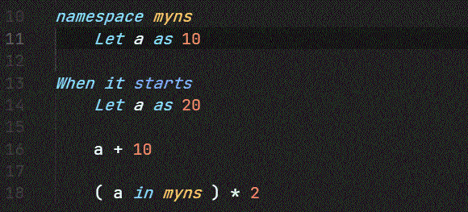

# Language support for English++, Worldlang

[Worldlang](https://github.com/heartleth/worldlang) is more extensible English++.

Existing English++ extension doesn't has many functions, so I add some.
